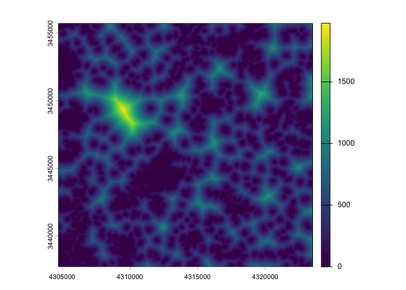

<!-- README.md is generated from README.Rmd. Please edit that file -->

# citoMove

The goal of citoMove is to provide an user-friendly R package for
analyzing movement data with DNNs.

## Installation

You can install the development version of citoMove from
[GitHub](https://github.com/) via:

``` r
# install.packages("devtools")
devtools::install_github("citoverse/citoMove")
```

# Examples

## One animal

``` r
library(amt)
#> 
#> Attaching package: 'amt'
#> The following object is masked from 'package:stats':
#> 
#>     filter
library(citoMove)
#> Loading required package: cito
library(terra)
#> Warning: package 'terra' was built under R version 4.5.2
#> terra 1.8.86
```

First we create a new covariate: the distance to the next forest.

``` r
forest <- get_sh_forest()
forest <- terra::subst(forest, 0, NA)
forest_dist <- distance(forest)
names(forest_dist) <- "forest_dist"
plot(forest_dist)
```



Then we load the tracking data of one red deer.

``` r
data(deer)
dat_ssf <- deer |> 
  steps_by_burst() |> 
  random_steps() |> 
  extract_covariates(forest_dist) |> 
  time_of_day()
#> Warning in random_steps.bursted_steps_xyt(steps_by_burst(deer)): Some bursts
#> contain < 3 steps and will be removed
```

And fit a deep neural network (dnn):

``` r
# returns error
# Error in (function (self, shape)  : 
# shape '[75, 11]' is invalid for input of size 830
# dnn_ssf(formula = case_ ~ forest_dist, data = dat_ssf)
```
