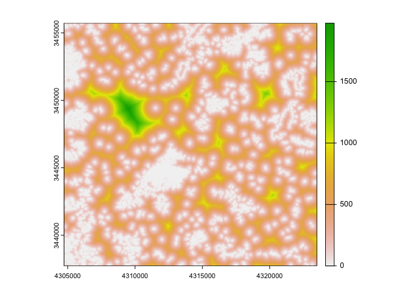
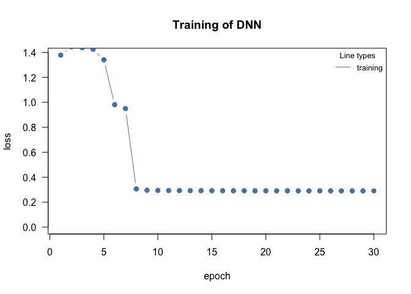
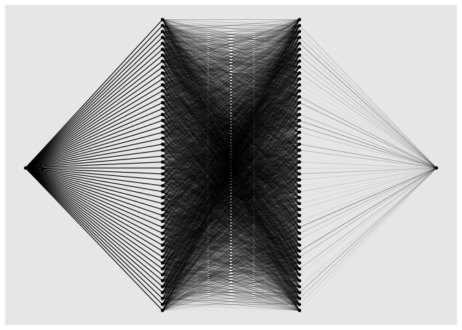
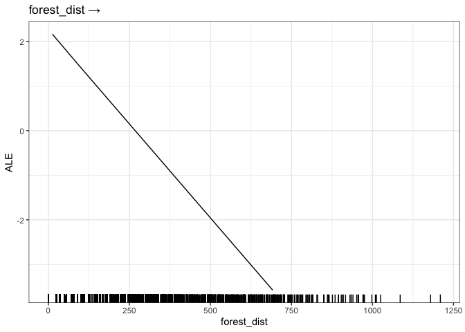

<!-- README.md is generated from README.Rmd. Please edit that file -->

# citoMove

The goal of citoMove is to provide an user-friendly R package for
analyzing movement data with DNNs.

## Installation

The current version of citoMove depends on the **development** version
of cito, which can be installed via:

``` r
# install.packages("devtools")
devtools::install_github('citoverse/cito')
```

You can install the development version of citoMove from
[GitHub](https://github.com/) via:

``` r
devtools::install_github("citoverse/citoMove")
```

# Example - analysis of a deer movement track

``` r
set.seed(123)
library(amt)
#> 
#> Attaching package: 'amt'
#> The following object is masked from 'package:stats':
#> 
#>     filter
library(citoMove)
#> Loading required package: cito
library(terra)
#> terra 1.7.29
```

The following code creates a spatial covariate: the distance to the next
forest.

``` r
forest <- amt::get_sh_forest()
forest <- terra::subst(forest, 0, NA)
forest_dist <- distance(forest)
names(forest_dist) <- "forest_dist"
plot(forest_dist)
```



Next, we load the tracking data of one red deer individual. From amt
documentation: 826 GPS relocations of one red deer from northern
Germany. The data is already resampled to a regular time interval of 6
hours and the coordinate reference system is transformed to epsg:3035.

The follwoing code orders the data, creates random absences, and extract
the environmental predictor (distance to forest) create before for all
true and random steps.

``` r
dat_ssf <- amt::deer |> 
  steps_by_burst() |> 
  random_steps() |> 
  extract_covariates(forest_dist) |> 
  time_of_day() |> 
  mutate(case_ = as.integer(case_))
#> Warning in random_steps.bursted_steps_xyt(steps_by_burst(amt::deer)): Some
#> bursts contain < 3 steps and will be removed
```

Now, we can fit the deep neural network (dnn) using citoMove:

``` r
model = dnn_ssf(case_ ~ forest_dist, data = dat_ssf, epoch = 30L, plot = T, verbose = FALSE)
#> Registered S3 methods overwritten by 'reformulas':
#>   method       from
#>   head.call    cito
#>   head.formula cito
#>   head.name    cito
```



The plot that is produced visualizes the improvement of the model during
training. The default architecture of the neural networks entails two
hidden layers. We can visualize the architecture via

``` r
plot(model)
#> Warning: Using the `size` aesthetic in this geom was deprecated in ggplot2 3.4.0.
#> ℹ Please use `linewidth` in the `default_aes` field and elsewhere instead.
#> ℹ The deprecated feature was likely used in the cito package.
#>   Please report the issue at <https://github.com/citoverse/cito/issues>.
#> This warning is displayed once every 8 hours.
#> Call `lifecycle::last_lifecycle_warnings()` to see where this warning was
#> generated.
```



A summary of the fitted model is provided via

``` r
summary(model)
#> Summary of Deep Neural Network Model
#> 
#> Feature Importance:
#>      variable importance_1
#> 1 forest_dist    0.1122311
#> 
#> Average Conditional Effects:
#>               Response_1
#> forest_dist 0.0004258009
#> 
#> Standard Deviation of Conditional Effects:
#>             Response_1
#> forest_dist  0.0081913
```

The cito package contains several options to create effect plots. Our
current recommendation is to use accumulated local effect (ALE) plots to
visualize the estimated selection effects

``` r
ALE(model)
#> Number of Neighborhoods reduced to 3
```


